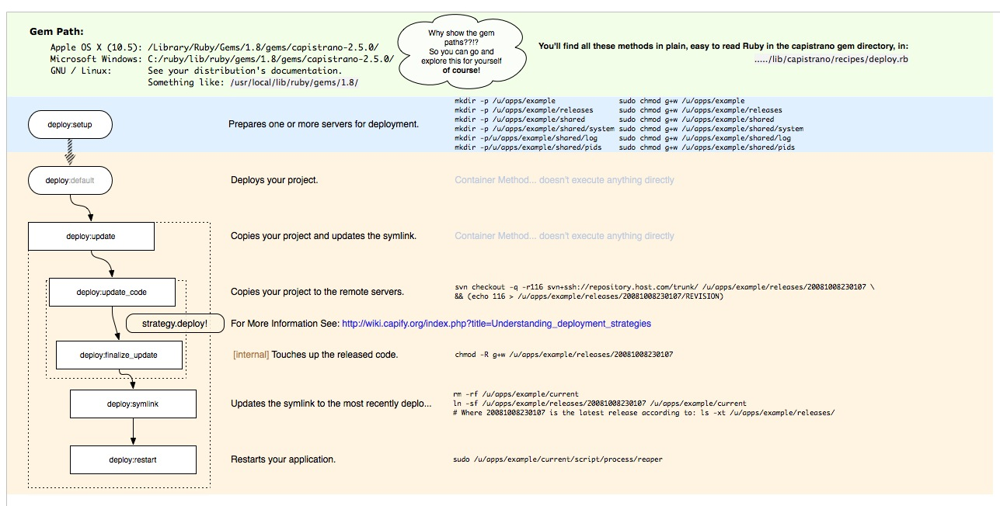

!SLIDE bullets incremental
# Capistrano Deploy #
* Strategy
* Dependencies (Bundler)
* Deploy Tasks
* Task Hooks
* Sample Deploy

!SLIDE bullets commandline
# Deploy Strategy #
* Maintain git repo on the server
* Define how and where to put code

<pre style="margin-left: 200px">
set :use_sudo, false
set :deploy_to, "#{web_root}/#{user}/#{application}"
set :deploy_via, :remote_cache
</pre>

!SLIDE bullets
# Deploy Dependencies #
* Manually script apt/rpm deps (Im ageMagick, etc)
* Bundler handles ruby deps

!SLIDE bullets

# Deploy Tasks #

* 'cap deploy' runs standard tasks (callback'able)

<pre style="margin-left: 200px">
# cap deploy:update
# cap deploy:symlink
# cap deploy:restart
</pre>

* 'cap deploy' won't run first time until setup

<pre style="margin-left: 200px">
# cap deploy:setup
# cap deploy:check
</pre>

!SLIDE center
#### http://github.com/leehambley/capistrano-documentation-support-files/ ####

!SLIDE bullets commandline
# Task Hooks #
* Extend standard deploy task via callbacks

<pre style="margin-left: 100px">
before 'deploy', 'deploy:check'
before 'deploy', 'deploy:web:disable'

after 'deploy:update_code', 'bundler:bundle_install'
after 'deploy:update_code', 'app_setup' if run_app_setup
after 'deploy:update_code', 'db_migrate'

after 'deploy:symlink', 'clear_cache'

after 'deploy', 'deploy:web:enable'
</pre>

!SLIDE bullets

# Sample Deploy #

* [jump to shell]